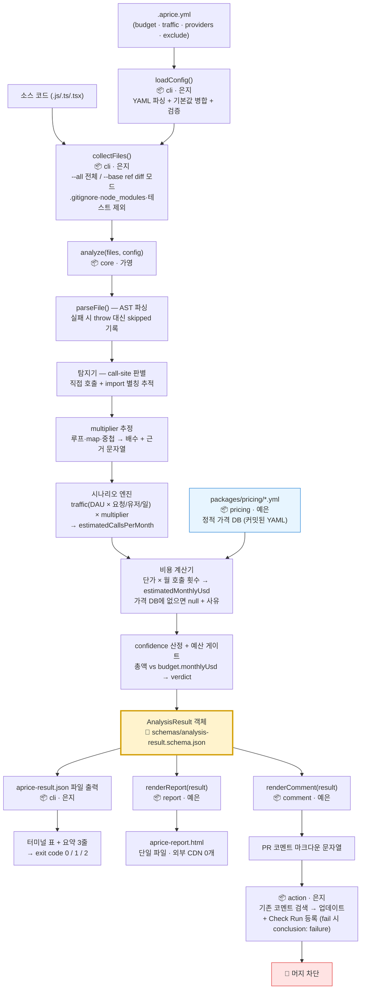

# AGENT.md — AI 에이전트용 프로젝트 컨텍스트

> 이 문서는 **AI 코딩 에이전트가 이 레포를 처음 열었을 때 읽는 파일**이다.
> 사람용 설명은 [`ROADMAP.md`](./ROADMAP.md)(일정·할 일)와 [`ROLES.md`](./ROLES.md)(권한·경계)에 있다.
> **충돌 시 우선순위: `ROLES.md` > `ROADMAP.md` > `AGENT.md`.**
> 이 문서가 두 문서와 어긋나면 이 문서가 틀린 것이다. 고쳐서 커밋한다.

---

## 1. 한 줄 요약

**APrIce** — 코드에서 **유료 외부 API 호출을 정적 분석으로 탐지**해 **월 예상 비용**을 계산하고, **예산 초과 시 PR 머지를 차단**하는 CLI + GitHub Action 오픈소스 도구. (TypeScript / Node.js 20+ / pnpm 모노레포)

핵심 가치: **"코드가 머지되기 전에 API 비용을 안다."** — 기존 도구는 사후 관측(observability), APrIce는 사전 차단(prevention).

### 명칭 주의 (에이전트가 가장 많이 틀리는 부분)

| 틀린 표기 | 올바른 표기 |
|---|---|
| `tollgate`, `tollgate scan` | **`aprice`**, `aprice scan` (구 프로젝트명이 `tollgate`였음) |
| `tollgate.yml` | **`.aprice.yml`** (점으로 시작, 레포 루트) |
| `packages/engine` | **`packages/core`** |
| `result.json` | **`aprice-result.json`** |

---

## 2. 핵심 개념 (프로젝트 고유 용어)

에이전트는 아래 용어를 **일반적 의미가 아니라 여기 정의된 의미로만** 해석한다.

| 용어 | 정의 | 오해 주의 |
|---|---|---|
| **detection (탐지)** | 소스 코드 안에서 발견한 **유료 API 호출 1건**. `file`, `line`, `provider`, `product`를 가진다 | 실제 실행 기록이 아니다. **정적 분석 추정치**다 |
| **call-site (호출 지점)** | AST 상에서 유료 API 함수가 실제로 호출되는 노드 위치. `openai.chat.completions.create(...)`의 `CallExpression` | import 문·타입 선언·변수 할당은 call-site가 **아니다**. 호출되는 지점만 센다 |
| **multiplier (배수)** | 하나의 call-site가 **한 번의 사용자 요청당 몇 번 실행되는지**의 추정 배수. 루프/`map`/배열 순회 내부면 `> 1` | 트래픽 배수가 아니다. 트래픽은 시나리오 엔진이 따로 곱한다. 배수의 **근거는 반드시 `multiplierReason` 문자열로 남긴다** |
| **시나리오 엔진 (scenario engine)** | `.aprice.yml`의 `traffic` (DAU × 요청/유저/일) × `multiplier` → **월 예상 호출 횟수**를 산출하는 로직 | 서버 로그·실측 트래픽을 읽지 않는다. **사용자가 설정 파일에 적은 가정값**이 유일한 입력이다 |
| **가격 DB (price DB)** | `packages/pricing/*.yml` — 레포에 **커밋된 정적 YAML** 가격 데이터. provider별 1파일 | 런타임에 가격 페이지를 크롤링하지 **않는다**. 모든 항목에 `source_url` + `checked_at` 필수 |
| **예산 게이트 (budget gate)** | 총 예상 비용 vs `.aprice.yml`의 `budget.monthlyUsd` 비교 → `verdict` 결정 → **exit code / Check Run failure로 머지 차단** | 자동으로 코드를 고치거나 지우지 않는다. **경고와 차단**만 한다 |
| **verdict** | 예산 게이트의 판정 3종: `pass`(정상) / `warn`(예산 80% 초과) / `fail`(100% 초과) | `warn`을 Action 실패로 볼지는 **아직 미결(§9 TODO-2)** |
| **confidence** | 해당 추정치의 신뢰도 3단계: `high` / `medium` / `low` | 판정 기준은 가영 소유. 리포트에서 **기준을 임의 해석해 표기하지 않는다** |
| **미지원 provider** | 가격 DB에 없는 provider. **탐지는 하되** `estimatedMonthlyUsd: null` + 사유 표기 | 조용히 무시하지 않는다. "가격 정보 없음"으로 리포트에 노출한다 |
| **skipped** | 파싱 실패 등으로 분석하지 못한 파일. `{ file, reason }` | 파싱 오류로 **전체 스캔이 죽으면 안 된다**. 반드시 skipped로 기록하고 계속 진행 |

### 스코프 아웃 (제안 자체가 위반)

- 백엔드 서버 / DB / 인증·로그인 / API 엔드포인트 — **누구의 영역도 아니다.**
- 풀스택 대시보드 — 웹은 **의존성 0의 단일 정적 HTML 파일**까지다.
- 런타임 가격 크롤링 / 환율 API 호출.
- v1 분석 대상 언어는 **JavaScript / TypeScript만.** Python은 로드맵(§9)이지 현재 스코프가 아니다.

---

## 3. 레포 구조

```
/
├── packages/
│   ├── cli/        # 은지 — aprice init/scan/report, 설정 로더, 파일 수집기, 터미널 출력, exit code
│   ├── action/     # 은지 — GitHub Action 엔트리, PR 코멘트 게시, Check Run 등록, ncc 번들
│   ├── core/       # 가영 — AST 파싱, 탐지기, multiplier 추정, 시나리오 엔진, 비용 계산, verdict
│   ├── report/     # 예은 — renderReport(): 결과 JSON → 단일 HTML 파일 (외부 CDN 0개)
│   ├── comment/    # 예은 — renderComment(): 결과 JSON → PR 코멘트 마크다운 문자열
│   └── pricing/    # 예은 — 가격 YAML DB (schema.yml + provider별 *.yml) / 스키마는 가영과 공동
├── schemas/        # 🤝 3인 공동 — analysis-result.schema.json (제품의 헌법)
├── fixtures/       # 🤝 3인 공동 — sample-result.json + provider별 테스트 소스 6종
├── .github/workflows/  # 은지 단독
├── action.yml      # 은지 단독 — GitHub Action 정의
├── ROADMAP.md      # 일정·할 일 체크리스트 (E/G/Y 항목 번호의 정의처)
├── ROLES.md        # 역할 경계·소유권·변경 절차 (분쟁 시 정본)
└── AGENT.md        # 이 문서
```

### "이 기능을 고치려면 어디를 보나" 매핑

| 하려는 일 | 봐야 할 위치 | 소유자 |
|---|---|---|
| CLI 서브커맨드·옵션 추가 | `packages/cli/src/commands/` | 은지 |
| `.aprice.yml` 파싱·검증·기본값 | `packages/cli/` `loadConfig()` | 은지 |
| 스캔 대상 파일 선정 (전체/diff 모드) | `packages/cli/` `collectFiles()` | 은지 |
| 터미널 출력 표·색상 | `packages/cli/` 포맷터 | 은지 |
| exit code 동작 | `packages/cli/` (§7 규칙 확인) | 은지 |
| PR 코멘트를 **게시**하는 코드 | `packages/action/` | 은지 |
| GitHub Action 입력·권한·번들 | `action.yml`, `packages/action/` | 은지 |
| API 호출 **탐지 규칙** | `packages/core/src/detector/` | 가영 |
| 루프/중첩 배수 추정 | `packages/core/` multiplier 로직 | 가영 |
| 월 호출 횟수 산출 (트래픽) | `packages/core/` 시나리오 엔진 | 가영 |
| 비용 계산식 / 반올림 | `packages/core/` 비용 계산기 | 가영 |
| `verdict` / `confidence` 판정 기준 | `packages/core/` | 가영 |
| HTML 리포트 레이아웃·CSS·차트 | `packages/report/` | 예은 |
| PR 코멘트 **문구·마크다운 구조** | `packages/comment/` | 예은 |
| 가격 숫자·`source_url`·`checked_at` | `packages/pricing/*.yml` | 예은 |
| 결과 JSON 필드 추가/변경 | `schemas/` + `fixtures/` (§7 절차 필수) | 3인 공동 |

---

## 4. 팀원별 소유 영역

**철칙: 남의 디렉토리 파일은 한 글자도 고치지 않는다. 오타 수정도 예외가 아니다.**
고쳐야 하면 코드를 바꾸지 말고 **소유자에게 요청할 내용을 출력**한다.

에이전트는 작업 시작 전에 **"지금 수정하려는 파일의 소유자가 누구인지"** 를 먼저 판단한다.
사용자가 자신을 밝히지 않았다면, **소유 경계를 넘는 수정은 하지 말고 그 사실을 알린다.**

| 소유자 | 단독 소유 | 만드는 것 | 절대 만들지 않는 것 |
|---|---|---|---|
| **은지** (백엔드/CLI/GitHub) | `packages/cli/`, `packages/action/`, `.github/workflows/`, `action.yml` | 제품의 **골격** — 파이프라인, 직렬화, GitHub 연동 | **숫자**(계산식·판정 기준), **화면**(HTML/CSS/마크다운 문구) |
| **가영** (분석 엔진) | `packages/core/` | 제품의 **두뇌** — 탐지, 배수, 시나리오, 비용, verdict | **파일 탐색**(git/fs 접근), **화면**, exit code 값 결정 |
| **예은** (리포트/데이터/배포) | `packages/report/`, `packages/comment/`, `packages/pricing/`, `README.md` | 제품의 **얼굴** — HTML 리포트, 코멘트 문구, 가격 DB, npm 배포 | **숫자**(렌더러에서 보정 금지), **GitHub 게시 로직** |
| **3인 공동** | `schemas/`, `fixtures/`, `.aprice.yml` 스펙, `ROADMAP.md`, `ROLES.md` | — | 단독 변경 (§7 절차 필수) |

### 경계에서 가장 자주 깨지는 3가지 (에이전트 특히 주의)

1. **CLI 배선 중 `core` 내부가 답답해서 직접 고치기** → 고치지 말고 *"이 입력에 이 출력이 필요하다"* 는 **인터페이스 요청**으로 표현한다.
2. **계산 결과가 이상해서 `pricing/*.yml` 숫자를 "잠깐만" 고치기** → 고치지 말고 **테스트에서 하드코딩 픽스처**를 쓴다. 실제 YAML 수정은 예은에게 요청.
3. **리포트 숫자가 이상해서 렌더러에서 반올림·보정하기** → 보정하지 말고 **`core`의 버그로 보고**한다. CLI 출력과 리포트 숫자가 달라지는 순간 데모가 무너진다.

### 패키지 간 의존 규칙

- 공개 API는 **각 패키지 루트 `index.ts`에서만** 노출한다.
- 남의 패키지 **내부 경로 직접 import 금지** (`@aprice/core/src/detector/...` ❌).
- `core`는 **파일 시스템·git에 접근하지 않는다.** 경로 배열을 인자로 받기만 한다. (테스트 가능성 보장)
- `report` / `comment`는 **결과 JSON만 입력으로 받는다.** core를 직접 호출하지 않는다.

---

## 5. 핵심 데이터 흐름

`aprice scan` 실행 시 데이터는 아래 순서로만 흐른다. **역방향 호출·건너뛰기 없음.**



### 흐름에서 반드시 지킬 것

| 규칙 | 이유 |
|---|---|
| `core`는 파일 경로 **배열만** 받는다. 스스로 파일을 찾지 않는다 | git 의존이 생기면 단위 테스트가 불가능해진다 |
| 가격 DB는 `core`가 **읽기만** 한다 | 계산이 틀렸을 때 원인이 데이터인지 로직인지 가려야 한다 |
| `AnalysisResult`가 **유일한 교차점**이다 | 세 파트가 이 객체 하나로만 통신한다. 여기가 흔들리면 3명이 동시에 멈춘다 |
| 렌더러(`report`/`comment`)는 **숫자를 변형하지 않는다** | CLI 출력과 리포트 숫자가 달라지면 안 된다. 표시 포맷팅만 허용 |
| exit code는 **CLI 계층에서만** 결정한다 | `core`는 `verdict`까지만 만든다 |

---

## 6. 결과 JSON 스키마 (`AnalysisResult`)

세 파트가 공유하는 **유일한 인터페이스**. 정본은 `schemas/analysis-result.schema.json`,
실제 예시는 `fixtures/sample-result.json`. **아래 표와 스키마 파일이 다르면 스키마 파일이 정본이다.**

### 최상위

| 필드 | 타입 | 필수 | 설명 |
|---|---|---|---|
| `version` | `string` | ✅ | 스키마 버전. §6.3 규칙 참조 |
| `generatedAt` | `string` (ISO 8601 UTC) | ✅ | 결과 생성 시각 |
| `repo` | `object` | ✅ | 레포 컨텍스트 |
| `budget` | `object` | ✅ | 사용자가 설정한 예산 |
| `traffic` | `object` | ✅ | 시나리오 엔진 입력 (가정값) |
| `summary` | `object` | ✅ | 결론 — 터미널/코멘트 상단에 쓰이는 값 |
| `detections` | `Detection[]` | ✅ | 탐지 결과 배열. 0건이면 빈 배열 (`null` 금지) |
| `skipped` | `Skipped[]` | ✅ | 분석 실패 파일. 없으면 빈 배열 |

### `repo`

| 필드 | 타입 | 설명 |
|---|---|---|
| `name` | `string` | `owner/repo` 형식 |
| `baseRef` | `string \| null` | diff 기준 ref. 전체 스캔 시 `null` |
| `headRef` | `string \| null` | 현재 브랜치. 로컬 실행 시 `null` 가능 |

### `budget`

| 필드 | 타입 | 설명 |
|---|---|---|
| `monthlyUsd` | `number` | 월 예산 (USD) |
| `currency` | `"USD"` | v1은 USD 고정. KRW 병기 여부는 미결(§9 TODO-3) |

### `traffic`

| 필드 | 타입 | 설명 |
|---|---|---|
| `dau` | `number` | 일간 활성 사용자 수 (사용자 입력 가정값) |
| `requestsPerUserPerDay` | `number` | 사용자 1인당 하루 요청 수 |

### `summary`

| 필드 | 타입 | 설명 |
|---|---|---|
| `totalMonthlyUsd` | `number` | 월 예상 총액. 소수점 2자리 |
| `deltaMonthlyUsd` | `number \| null` | 이 PR로 **증가한** 비용. 전체 스캔 모드에서는 `null` |
| `verdict` | `"pass" \| "warn" \| "fail"` | 예산 게이트 판정. `warn` = 80% 초과, `fail` = 100% 초과 |
| `detectionCount` | `number` | `detections.length`와 항상 일치해야 한다 |

### `Detection`

| 필드 | 타입 | 필수 | 설명 |
|---|---|---|---|
| `id` | `string` | ✅ | 결과 내 고유 ID (`d1`, `d2`…). 리포트 앵커 링크에 사용 |
| `provider` | `string` | ✅ | 소문자 provider 키. 가격 DB 파일명과 일치 (`openai`, `anthropic`, `twilio`…) |
| `product` | `string \| null` | ✅ | 제품/모델 ID (`gpt-4o`). 판별 불가 시 `null` |
| `file` | `string` | ✅ | 레포 루트 기준 **상대 경로**. 절대 경로 금지 |
| `line` | `number` | ✅ | call-site 시작 줄 (1-based) |
| `snippet` | `string` | ✅ | 호출부 축약 문자열. **비밀키가 섞이지 않도록 인자값은 `{...}`로 축약** |
| `multiplier` | `number` | ✅ | 요청당 실행 배수. 기본 `1` |
| `multiplierReason` | `string` | ✅ | 배수 근거 한글 문자열. `multiplier === 1`이면 `"단일 호출"` |
| `estimatedCallsPerMonth` | `number` | ✅ | 시나리오 엔진 산출값 |
| `estimatedMonthlyUsd` | `number \| null` | ✅ | 월 예상 비용. **미지원 provider면 `null`** |
| `unsupportedReason` | `string \| null` | ✅ | `estimatedMonthlyUsd`가 `null`인 사유 (예: `"가격 정보 없음"`) |
| `confidence` | `"high" \| "medium" \| "low"` | ✅ | 추정 신뢰도 |
| `isNew` | `boolean` | ✅ | diff 모드에서 이번 변경으로 추가된 호출인지. 전체 스캔 시 `false` |

### `Skipped`

| 필드 | 타입 | 설명 |
|---|---|---|
| `file` | `string` | 상대 경로 |
| `reason` | `string` | `parse_error` / `unsupported_language` / `excluded` 등 |

### 6.3 `schema_version` 버저닝 규칙

`version` 필드는 **정수 문자열**(`"1"`, `"2"`)로 관리한다.

| 변경 종류 | version | 조치 |
|---|---|---|
| **필드 추가** (기존 필드 그대로) | 올리지 **않는다** | 소비자는 모르는 필드를 무시한다 |
| **필드 이름 변경 / 삭제 / 타입 변경** | **+1** | 파괴적 변경. §7 절차 + 전원 합의 필수 |
| 값의 의미 변경 (예: `warn` 임계값) | 올리지 않되 **ROADMAP.md에 결정 기록** | 코드가 아니라 정책 변경 |

**소비자 규칙**: `report` / `comment` / `action`은 로드한 JSON의 `version`이 **지원 범위 밖이면 렌더링하지 말고 명확한 한글 에러**를 낸다. 추측해서 렌더링하지 않는다.

**Day 3 이후 필드를 지우고 싶을 때**: 지우지 말고 **`deprecated` 주석만 달고 방치**한다.
(7일 프로젝트에서 필드 하나 남는 비용 < 3명이 동시에 깨지는 비용)

---

## 7. 에이전트가 코드를 수정할 때 지켜야 할 규칙

### 7.1 절대 금지 (에이전트가 혼자 결정하면 안 되는 것)

| # | 금지 사항 | 대신 할 것 |
|---|---|---|
| R1 | **결과 JSON 스키마 필드의 이름 변경·삭제·타입 변경** | 코드를 바꾸지 말고 §7.2 절차 안내문을 출력한다 |
| R2 | **exit code 규칙 변경** — `0` 통과 / `1` 예산 초과 / `2` 실행 오류. 이 3개는 고정 | 새 상황이 생겨도 셋 중 하나로 매핑한다. 4번째 코드를 만들지 않는다 |
| R3 | **가격 DB YAML 스키마 임의 변경** (`unit`, `free_tier`, 필드 구조) | 가영·예은 2인 합의 사항. 형식 변경 제안만 출력 |
| R4 | **가격 숫자 / `source_url` / `checked_at` 수정** | 계산이 안 맞으면 테스트에 하드코딩 픽스처를 쓴다 |
| R5 | **테스트 없이 핵심 로직 수정** — 탐지기·multiplier·시나리오 엔진·비용 계산기·verdict | 로직 변경과 **같은 커밋에 테스트를 포함**한다. `core` 커버리지 70% 유지 |
| R6 | **다른 사람 소유 디렉토리 수정** (§4) | 오타조차 고치지 않는다. 요청 문구를 출력한다 |
| R7 | **서버 · DB · 인증 · API 엔드포인트 · 풀스택 대시보드 추가** | 스코프 아웃. 제안이 나오면 5분 내 기각하고 백로그로 보낸다 |
| R8 | **`multiplier` 추정 규칙 / `confidence` 판정 기준 변경** | 숫자의 신뢰도 = 제품 신뢰도. 팀 결정 사항 |
| R9 | **`main` 브랜치 직접 push** | 항상 `feat/` · `fix/` · `docs/` · `chore/` 브랜치 + PR |
| R10 | **지원 provider 목록 증감**, **지원 언어 추가** | 팀 결정 사항 (§9) |
| R11 | **렌더러에서 숫자 보정** (반올림·클램프·기본값 대입) | `core` 버그로 보고한다 |
| R12 | **`any` 타입 사용** | `strict: true`. 불가피하면 `// eslint-disable` + 사유 주석 |

### 7.2 스키마 변경 절차 (예외 없음)

1. 팀 채널에 `[스키마변경]` 태그 — **무엇을 / 왜 / 누가 영향받는지**
2. 나머지 **2명 모두** 👍
3. `schemas/`와 `fixtures/sample-result.json`을 **같은 PR에서 함께** 수정
4. PR 제목에 `chore(schema):` 접두사
5. 머지 후 완료 공지 + 각자 `pull` 확인

**공개 함수 시그니처도 동일하게 취급**한다:
`analyze()` · `renderReport()` · `renderComment()` · `loadConfig()` · `collectFiles()`

### 7.3 코드 컨벤션

| 항목 | 규칙 |
|---|---|
| 언어 | TypeScript, `strict: true` |
| 포매팅 | Prettier 기본값 + **세미콜론 O, 작은따옴표** |
| 파일명 | `kebab-case.ts` |
| 식별자 | 함수·변수 `camelCase`, 타입·인터페이스 `PascalCase` |
| export | 패키지 루트 `index.ts`에서만 public API 노출 |
| 주석 | **무엇을**이 아니라 **왜**를 쓴다. **비용 계산식에는 근거 주석 필수** |
| 사용자 노출 문자열 | **한글** (에러 메시지·CLI 출력·리포트·`multiplierReason`) |
| 코드 내 식별자 | 영어 |

### 7.4 커밋 / PR

커밋과 pr은 한국어로 쓴다

```
<type>(<scope>): <제목 50자 이내, 한글 가능>

[본문 — 왜 이렇게 했는지. 무엇을 했는지는 diff가 말해준다]
```

- **type**: `feat` `fix` `docs` `refactor` `test` `chore`
- **scope**: `cli` `core` `action` `report` `comment` `pricing` `schema`
- PR 크기 **400줄 이하**, 브랜치 수명 **최대 2일**, 머지 전 `pnpm build` + `pnpm test` 통과

```bash
# 좋은 예
feat(core): 루프 내부 API 호출에 multiplier 부여
fix(cli): diff 모드에서 삭제된 파일이 스캔 대상에 포함되던 문제 수정

# 나쁜 예
수정 / wip / asdf
```

### 7.5 에이전트가 막혔을 때

- 같은 문제에 **2시간 이상 붙잡지 않는다.** 시도한 것 3가지 + 에러 메시지를 정리해 사용자에게 보고한다.
- 우회가 필요하면 **mock/하드코딩으로 파이프를 먼저 뚫고**, 정확도는 나중에 보정한다.
- 판단이 갈리면 **추측해서 진행하지 말고 §9의 미결 목록에 해당하는지 먼저 확인**한다.

---

## 8. 자주 하는 작업 (How-to)

> 아래 명령들은 pnpm workspace 기준이다. 스크립트가 아직 없으면 **만들기 전에 `packages/*/package.json`을 확인**한다.

### 8.1 새 API 서비스를 가격 DB에 추가하기 — 소유자: 예은

1. `packages/pricing/<provider>.yml` 생성. 파일명 = `Detection.provider` 값 = 소문자 키.
   ```yaml
   provider: openai
   display_name: OpenAI
   source_url: https://openai.com/api/pricing/   # 공식 페이지만. 블로그·요약글 금지
   checked_at: 2026-07-22                        # 실제로 대조한 날짜 (YYYY-MM-DD)
   products:
     - id: gpt-4o
       unit: token            # token | request | gb | minute
       input_price_per_1k: 0.0025
       output_price_per_1k: 0.01
       free_tier: null
   ```
2. `pnpm validate:pricing` — 필수 필드 누락 · 중복 키 · 날짜 형식 검사
3. `packages/core`의 **탐지 규칙에도 이 provider가 있어야** 실제로 잡힌다 → 탐지 규칙 추가는 **가영에게 요청** (R6)
4. `fixtures/`에 해당 provider 테스트 소스 파일 추가 + 주석에 "탐지돼야 할 호출 N개" 명시
5. `pnpm test` → 커밋 `feat(pricing): <provider> 가격 데이터 추가`

**가격 숫자는 반드시 공식 페이지와 직접 대조한다. 기억이나 추정으로 채우지 않는다.**

### 8.2 새 언어(Python 등) 분석 지원 추가하기 — 소유자: 가영

> ⚠️ **v1 스코프 아웃.** 팀 결정 없이 착수 금지 (§9 TODO-6). 아래는 결정이 난 뒤의 절차다.

1. `packages/core/src/parser/`에 언어별 파서 래퍼 추가. 인터페이스는 기존 `parseFile(path)`와 동일하게 —
   실패 시 **throw 대신 `{ skipped, reason }` 반환**
2. 탐지 규칙을 언어별로 분리 (`detector/js.ts`, `detector/py.ts`). `AnalysisResult` 형태는 **언어와 무관하게 동일**해야 한다
3. `packages/cli`의 `collectFiles()` 확장자 목록에 추가 → **은지에게 요청** (R6)
4. `fixtures/`에 해당 언어 테스트 소스 추가
5. 새 언어 때문에 결과 JSON에 필드가 필요해지면 → **§7.2 절차**. 몰래 추가 금지

### 8.3 로컬에서 전체 파이프라인 테스트하기

```bash
pnpm install
pnpm build                       # 6개 패키지 전부 빌드
pnpm test                        # vitest

# 1) 설정 파일 생성
pnpm aprice init                 # 대화형 → .aprice.yml

# 2) 전체 스캔
pnpm aprice scan --all           # → aprice-result.json

# 3) diff 모드 (PR과 동일한 경로)
pnpm aprice scan --base main

# 4) exit code 확인 (핵심 검증 지점)
echo $?                          # 0=통과 / 1=예산 초과 / 2=실행 오류
# PowerShell: $LASTEXITCODE

# 5) HTML 리포트
pnpm aprice report               # → aprice-report.html (더블클릭해서 열기)

# 6) 결과 JSON이 스키마를 만족하는지
npx ajv validate -s schemas/analysis-result.schema.json -d aprice-result.json
```

**렌더러만 고칠 때는 CLI 실행 없이** `fixtures/sample-result.json`을 입력으로 쓴다.
(예은은 Day 2~4 동안 이 방식으로 은지의 CLI 완성을 기다리지 않고 개발한다)

### 8.4 `act`로 GitHub Actions 로컬 테스트하기 — 소유자: 은지

```bash
# 사전: Docker 실행 중 + act 설치 (brew install act / winget install nektos.act)

pnpm build && pnpm --filter @aprice/action bundle   # dist/index.js 번들이 최신이어야 한다

# PR 이벤트 페이로드로 실행
act pull_request \
  -e .github/test-events/pull_request.json \
  -s GITHUB_TOKEN="$GITHUB_TOKEN" \
  -W .github/workflows/aprice.yml
```

| 주의 | 내용 |
|---|---|
| 번들 갱신 | `action.yml`은 `dist/index.js`를 실행한다. **소스만 고치고 번들을 다시 만들지 않으면 옛 코드가 돈다** |
| 토큰 | `-s GITHUB_TOKEN` 없으면 코멘트 게시·Check Run이 전부 실패한다. **토큰을 파일이나 커밋에 남기지 않는다** |
| 한계 | `act`는 Check Run UI·머지 버튼 비활성화를 재현하지 못한다. **이 둘은 실제 데모 레포 PR에서만 검증 가능** |
| 권한 | 실제 워크플로에는 `permissions: pull-requests: write`, `checks: write` 필요 |

---

## 9. 현재 미결 사항 (TODO)

> 아래는 **팀이 아직 결정하지 않은 것들이다. 에이전트는 임의로 결정하지 않는다.**
> 작업이 이 항목에 걸리면 **진행을 멈추고 사용자에게 결정을 요청**한다.
> 결정이 나면 `ROADMAP.md`/`ROLES.md`에 반영하고 이 목록에서 지운다.

| # | 미결 항목 | 왜 혼자 결정 못 하나 | 데드라인 |
|---|---|---|---|
| TODO-1 | `analysis-result.schema.json` **필드 구조 최종 확정** | 은지가 직렬화하고 가영이 채우고 예은이 그린다. **셋의 계약** | Day 1 저녁 (IP-1) 🔴 최우선 |
| TODO-2 | `warn`(예산 80% 초과)을 **Action 실패로 볼 것인가** | 제품 정책. 개발자 경험에 직결 | Day 4 종료 |
| TODO-3 | 통화 표기 — **USD only vs USD+KRW 병기** | 환율 소스가 필요해지면 스코프가 커진다 | Day 4 종료 |
| TODO-4 | `multiplier` 추정 규칙 — **루프를 몇 배로 볼 것인가** | 숫자의 신뢰도 = 제품 신뢰도. 심사 질문 1순위 | Day 3 종료 |
| TODO-5 | `confidence` **3단계 판정 기준** | 예은이 배지로 노출하고 발표에서 설명해야 함 | Day 4 종료 |
| TODO-6 | 지원 provider **6종 유지 vs 3종 축소**(OpenAI/Anthropic/Twilio) | 가영의 탐지 정확도 + 예은의 조사량에 동시 영향 | Day 4 종료 |
| TODO-7 | 가격 YAML 스키마 — `unit` 종류, **무료 티어 표현 방식** | 예은이 6종을 이 형식으로 채운다. 나중에 바꾸면 통째로 재작업 | Day 1 저녁 (IP-2) |
| TODO-8 | `.aprice.yml` **사용자 설정 스펙 확정** (특히 `traffic`, `exclude`) | `traffic`은 가영 시나리오 엔진의 입력 | Day 1 저녁 |
| TODO-9 | npm 패키지명 **`aprice` 선점 여부** | 선점돼 있으면 제품명·README·발표자료 전부 영향 | Day 5 종료 |
| TODO-10 | 발표 데모 메인 경로 — **CLI 먼저 vs Action 먼저** | 발표 구성 전체가 바뀜 | Day 6 오후 (IP-5) |

### 결정 절차 (§ROLES 5.7)

```
[결정필요] 태그로 팀 채널에 올린다
  ① 결정할 것 (한 줄)  ② 선택지 2~3개  ③ 내 추천 + 이유  ④ 언제까지
        ↓
  3명 중 2명 동의 → 확정 → ROADMAP.md / ROLES.md에 반영 (PR)
```

- 데드라인까지 답이 없으면 **제안자가 결정하고 진행**한다.
- 확정된 결정은 **뒤집지 않는다.** 뒤집으려면 새 `[결정필요]`를 올린다.

---

## 10. 에이전트 체크리스트 (작업 시작 전 3초)

1. 지금 고치려는 파일의 **소유자가 누구인가?** (§4) — 남의 것이면 멈춘다
2. **결과 JSON 스키마**를 건드리는가? (§7.2) — 그렇다면 팀 합의 절차부터
3. **핵심 로직**(탐지·계산·시나리오·verdict)인가? — 테스트를 같은 커밋에 넣는다 (R5)
4. **§9 미결 목록**에 걸리는 결정을 하고 있는가? — 그렇다면 사용자에게 물어본다
5. 스코프 아웃(서버·DB·대시보드)을 만들고 있지 않은가? (R7)
